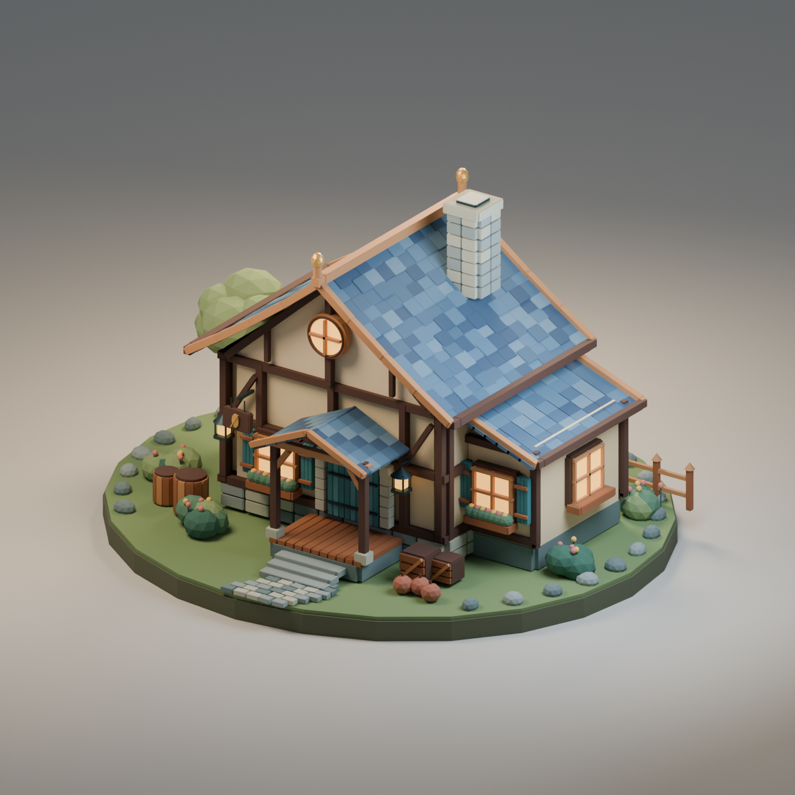

# Blender fast

A reusable Blender workflow for batched scene edits, measured rendering improvements and visual verification. Includes a Codex skill, local Blender Lab bridge helpers, an original fantasy house example and the raw benchmark results.



## Two different speedups

Scene construction and rendering have different bottlenecks. The local bridge sends Python commands to Blender. Reducing polling delays and grouping edits saves waiting between those commands. Cycles rendering then calculates the final image and needs its own optimization.

| House construction method | Bridge requests | Object creation |
| --- | ---: | ---: |
| Original polling, one object per request | 973 | 246.068 s |
| Faster polling, one object per request | 973 | 57.847 s |
| Faster polling, batches of 64 objects | 16 | 0.925 s |

The approximately 266× figure applies only to that deliberately chatty construction comparison. Setup, validation, staging, saving, AI thinking, the external MCP client/server and rendering are excluded. The 973-object house produced matching geometry and material fingerprints across all three builds. Each full-house strategy was measured once.

At the same 64 samples and 1,400 × 1,400 resolution, a separate rendering experiment found:

| Warm repeated Cycles render | Median of three renders |
| --- | ---: |
| Metal GPU rendering, CPU denoising, caching off | 9.168 s |
| Metal GPU rendering, GPU denoising, caching off | 6.218 s |
| Metal GPU rendering, GPU denoising, persistent data | 4.109 s |

That is about 2.2× faster for repeated renders of this unchanged scene. Each configuration had an excluded warmup. Persistent data uses extra memory and helps when reusable scene data stays in the same Blender process. These results do not establish the same gain for cold starts, different scenes, or different hardware.

A further fixed-quality device comparison found GPU-only MetalRT Auto at 3.880 s, CPU plus GPU at 7.111 s, and forced MetalRT at 4.251 s. More enabled devices were slower for this workload. These numbers belong to a separate experiment; compare within each table. [Device results](benchmarks/metal-comparison.json).

Measured on 9 September 2026 with Blender 5.2.0 LTS, Blender Lab MCP add-on 1.0.0, and an Apple M2 Max with a 30-core GPU. See [construction methodology](skills/blender-fast/references/benchmark.md), [rendering guidance](skills/blender-fast/references/rendering.md), and [raw measurements](benchmarks).

## Combined pipeline with a live preview

The selected strategy combines batched direct-data scene edits, faster supported bridge polling, GPU path tracing, GPU denoising and persistent data. On the tested M2 Max, keep Metal GPU only and MetalRT Auto. Preserve samples, resolution and the visual result; verify device support on another machine.

The new 228-object jet comparison measured **76.40 s versus 9.71 s** for one build plus four renders, about **7.87× faster**. Construction took 57.61 s versus 0.22 s; the warm render median was 3.96 s versus 1.79 s. These are different stages, and their ratios must not be multiplied.

The [live comparison guide](docs/live-comparison.md) includes the chosen settings, raw evidence and commands to launch the local side-by-side monitor. Watch acknowledged geometry creation, live timers and completed render images, then replay both measured runs from the same starting point. Measurement runs execute sequentially on one GPU to avoid contention. The recorded replay is labeled explicitly.

## Implement with an LLM agent

For new scenes, use the [current fast workflow](docs/fast-workflow.md): compose reusable shape definitions or scene recipes, update assemblies by stable ID, and keep Blender resident for **Eevee preview → Cycles 8 → Cycles 64** refinement. It uses the existing procedural builder and needs no custom generative model. The packaged and installed skill route agents to this path when it fits the brief.

Three fresh conservatory builds in a warmed process reached Eevee feedback in a median **0.517 s**, and all three renders plus editable save in **6.750 s**, starting from a prepared program. Agent authoring and visual review are additional work. The report also compares full scene revisions, explains lighting differences between browser views and Blender, and shows how to reuse the existing preview server.

Start with the [agent implementation guide](skills/blender-fast/references/agent-workflow.md). It includes the chosen path, a tested Blender Python recipe, batching and process-lifetime guidance, device verification and failure recovery. Codex uses the packaged skill; other LLM agents can read the same Markdown and adapt execution to their existing Blender tool. [AGENTS.md](AGENTS.md) routes agents working in this repository to that guide.

## Install the skill

The installer and bridge helpers require an existing Python 3.10+ installation and use the standard library. The render helpers run inside Blender and use its bundled `bpy` and NumPy.

```sh
git clone https://github.com/holokat/blender-fast.git
cd blender-fast
python3 scripts/install_skill.py
```

The skill installs into `$CODEX_HOME/skills/blender-fast`, or `~/.codex/skills/blender-fast` if `CODEX_HOME` is unset. It allows automatic skill selection. The installer refuses to replace an existing skill and does not edit unrelated configuration.

Invoke it explicitly with `$blender-fast`. To require it for all future Blender work, add this routing instruction to your Codex `AGENTS.md`, adjusting the path if needed:

```text
Before Blender modeling, scene editing, materials, animation, automation, MCP, bpy scripting or rendering work, load and apply ~/.codex/skills/blender-fast/SKILL.md. Use its default combined path and references/agent-workflow.md. Preserve the requested renderer, scene, bridge and quality settings, verify the hardware profile, and measure construction and rendering separately.
```

## Use the existing Blender Lab bridge

Open Blender with the existing Blender Lab MCP add-on enabled. These helpers do not install an add-on or register an MCP server in an AI client. They are specific to the Blender Lab null-delimited local TCP protocol and are not compatible with the separate ahujasid/blender-mcp protocol. If you already have a compatible MCP tool, use it and apply the same batching workflow.

```sh
python3 skills/blender-fast/scripts/blender_client.py status
python3 skills/blender-fast/scripts/polling_profile.py apply --snapshot work/polling-before.json
```

The tested profile uses a 50 ms active interval and a 250 ms idle interval. The helper preserves a shorter existing interval and the current idle delay. It records prior values, respects the installed property limits and changes the current session. Add `--persist` to save Blender preferences, including other pending preference edits. Faster polling means more frequent CPU wakeups; its CPU and battery cost was not measured.

To restore the snapshot:

```sh
python3 skills/blender-fast/scripts/polling_profile.py restore --snapshot work/polling-before.json
```

For scene edits, write a coherent Python stage, set a JSON-serializable dictionary named `result`, then send it:

```sh
python3 skills/blender-fast/scripts/blender_client.py --timeout 90 execute --file work/scene_step.py
```

Blender executes the supplied Python. Use trusted scripts. A timeout can happen after a mutation has executed, so inspect the current scene before retrying. The helper never automatically retries a command. [Protocol and rollback details](skills/blender-fast/references/bridge.md).

## Reproduce the house

`blender` below means your existing Blender executable. No external models, textures, fonts or asset services are needed.

```sh
blender --background --factory-startup --python examples/mmo-house/build_house.py -- --output work/house
```

This produces an editable `house.blend` and a geometry/material fingerprint. To render during the same build on an Apple Silicon Mac, add `--render --device METAL`. Choose the installed backend for another machine, or keep the default CPU backend.

With a live local Blender Lab bridge, test batched construction:

```sh
python3 examples/mmo-house/benchmark_house.py --mode batch --output work/house-batch.json
```

For the complete three-strategy comparison, use `--mode full` and a different output filename. The original individual-call baseline took about four minutes on the test machine. Test scenes are isolated and removed after verified responses. Polling preferences are restored without saving user preferences. If execution becomes uncertain, the benchmark stops automatic mutations and identifies the state to inspect.

## Test the helpers

```sh
python3 -m unittest discover -s tests -v
```

The protocol tests use a synthetic loopback server and never mutate a Blender scene. They cover fragmented Unicode responses, deadlines, disconnects, malformed replies, response limits and preference validation.

## License and scope

[MIT](LICENSE) covers this repository's original code, documentation and generated example artwork. Blender and the Blender Lab add-on are separate projects, are not bundled here, and retain their own licenses. No Blender add-on source is vendored. This is an independent workflow package, not an official Blender project.
