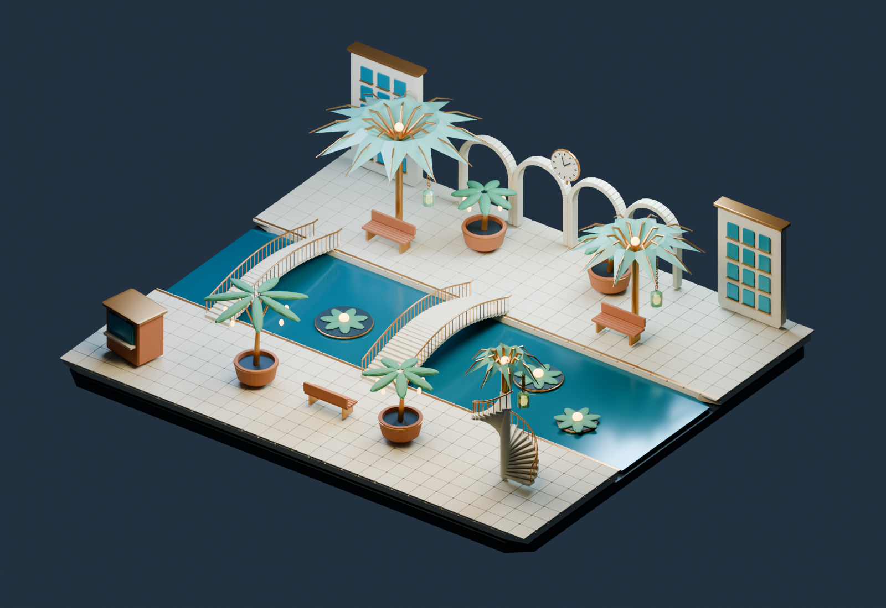

# Fast creation and progressive rendering

Use reusable procedural construction patterns, incremental scene updates and a resident Blender renderer. An LLM agent authors the composition; the existing Python compiler builds editable geometry. This workflow requires no custom generative model or training service.

## Choose the authoring interface

Use [shape programs](../skills/blender-fast/references/shape-programs.md) for reusable primitives, curves, profiles, repeated groups and named attachments. Inspect the construction catalog with `teaching.py list`; `compose` resolves the selected definitions into a standalone program without fitting or running a model. Use [scene recipes](../skills/blender-fast/references/scene-recipes.md) when their 23 finished procedural factories suit the scene. For unsupported forms, author a focused definition or batched Python builder.

Keep stable assembly IDs. Transform-only revisions update roots, unchanged geometry retains its objects and meshes, and changed definitions rebuild the affected assemblies. Validate the full data before applying it to the intended owned scene. Inspect state after an uncertain response before retrying.

## Show progress, then refine

| Profile | Renderer | Size | Purpose |
| --- | --- | --- | --- |
| `interactive` | Eevee, 4 samples | 800 × 550 | Early composition feedback |
| `optNEW` | Cycles, 8 samples with denoising | 1600 × 1100 | Lighting and material preview |
| `opt1` | Cycles, 64 samples with denoising | 1600 × 1100 | Higher-sample review and delivery when acceptable |

These are quality profiles, not three geometry generators. The smaller Eevee image can look grainy and its lighting differs from Cycles. Increase samples or resolution when the final artwork needs it. A clean-looking denoised still does not establish animation quality.

On the tested M2 Max, use Metal GPU only, MetalRT Auto, GPU OpenImageDenoise, adaptive sampling and persistent data. Keep related renders in one Blender process. CPU plus GPU and forced MetalRT were slower in the existing fixed-quality comparison. Other hardware requires verified device selection; these Cycles helpers currently require Metal.

The shape CLI already runs the progressive sequence:

```sh
mkdir -p work/conservatory
python3 skills/blender-fast/scripts/shape_program/teaching.py list
python3 skills/blender-fast/scripts/shape_program/teaching.py compose \
  examples/shape-programs/tidal-conservatory.layout.json --output work/program.json
python3 skills/blender-fast/scripts/shape_program/cli.py work/program.json --validate
blender --background --factory-startup --python-exit-code 1 \
  --python skills/blender-fast/scripts/shape_program/cli.py -- \
  work/program.json --output work/conservatory --profiles interactive optNEW opt1
```

It saves the prepared program, completed PNGs, an editable `scene.blend` and a timing report. `--worker` keeps the process alive while its input pipe remains open. Send one JSON request with `program` and `profile`, then await `SHAPE_FRAME` before sending another. An existing Blender worker can call `shape_program.compiler.apply(program, owned_scene)` directly.

## What the measurements establish



The conservatory contains 25 assemblies, 1,305 Blender objects and 41,972 mesh faces. Three trials created a fresh isolated scene and all geometry in an already warmed process. One tree parameter and each program hash changed between trials. No rendered-image cache was used.

| From prepared-program execution | Median cumulative time, three trials |
| --- | ---: |
| Validate and build | 0.315 s |
| Build and Eevee preview | 0.517 s |
| Through Cycles 8 preview | 2.255 s |
| Through all three renders and editable save | 6.750 s |

The Cycles 64 stage itself had a median of 4.203 s. An earlier cold-process run took 24.612 s through all renders and save; later framing and geometry corrections mean it is not a controlled cold-versus-warm comparison. Authoring the first valid layout took 128.290 s from its recorded checkpoint, excluding earlier planning and compiler development. Review and corrections added work. **Prepared-program execution under ten seconds does not establish prompt-to-finished-art in ten seconds.** [Fresh trials](../benchmarks/shape-programs/benchmark.json), [cold run](../benchmarks/shape-programs/cold-run.json), [authoring](../benchmarks/shape-programs/authoring.json).

The separate celestial-archive experiment measured ten warm revisions per path, moving or rotating nine assemblies and changing lighting and material color:

| Path | Median apply through saved PNG |
| --- | ---: |
| Per-part updates, Cycles 64 (`opt1`) | 7.202 s |
| Per-part updates, Cycles 8 (`optNEW`) | 2.075 s |
| Assembly-root updates, Cycles 8 | 1.892 s |
| Assembly-root updates, Eevee 16 at full size | 1.471 s |
| Assembly-root updates, Eevee 4 at half size | 0.608 s |

The 0.608 s preview is about 11.84× faster than that experiment's Cycles 64 baseline, with a visible quality tradeoff. The equivalent-profile Cycles 8 difference, 2.075 versus 1.892 s, is only about 10% and small relative to run variation. Both representations preserve geometry and edits; their Cycles images were close, not pixel-identical. This does not establish a large new equivalent-quality render improvement. [Raw revisions](../benchmarks/scene-recipes.json), [image comparisons](../benchmarks/scene-recipe-images.json).

These revision timings exclude agent authoring, startup, first renders, geometry comparison and `.blend` saving. Jobs ran sequentially on an M2 Max, 30-core GPU, Blender 5.2.0 LTS. OS caches, thermal conditions and other system activity were not controlled. Do not multiply these gains by unrelated bridge benchmarks.

## Reuse the preview and keep lighting honest

Reuse an existing loopback preview server instead of creating one for each scene. `preview/recipe-viewer/shapes.html` can read shape output served under `shape-output/`, or another same-origin directory passed with `?data=...`. Keep generated media out of Git. Its quality selector displays completed saved images; changing the selection does not render again.

For actual camera and lighting revisions, the recipe server keeps a Blender worker alive, combines pending changes and sends completed-frame events. An in-flight render finishes before the newest pending request starts. The browser's elapsed time includes settling, queueing, transfer and image decoding. Label a fixed reference image as a fixed reference.

A WebGL asset viewer does not reproduce Blender lighting just because it loads the same geometry. For lighting decisions, show a fresh Blender render with the scene's camera and lights. An orbitable browser view remains useful for inspecting geometry. State which renderer produced each view and verify the final Blender image.

## Agent completion checks

Preserve the requested objects, art direction and renderer. Inspect silhouette, intersections, material response, shadows, noise and framing. Save the intended active scene and verify it can be reopened. Measure authoring, construction, first render, refinements and review separately. The [implementation guide](../skills/blender-fast/references/agent-workflow.md) covers the GPU configuration and recovery behavior.
