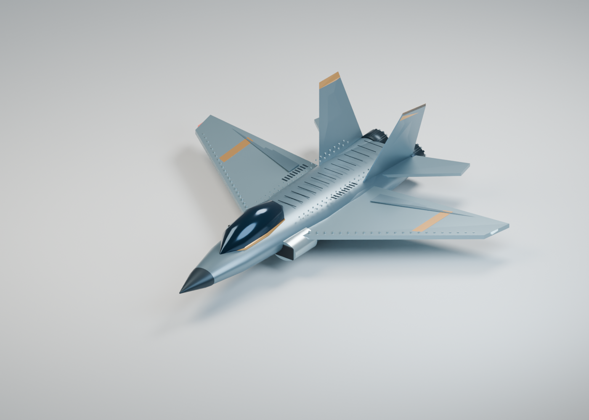

# Live jet comparison

The local preview combines the techniques selected from the house experiments: coherent batched scene edits, faster supported bridge polling, GPU path tracing, GPU denoising, and persistent render data. It includes an original decorative jet concept, with 228 objects, 4,496 vertices and 3,272 polygons. It is artwork, not a functional aircraft design or a replica.



## Chosen strategy

| Stage | Original lane | Combined lane |
| --- | --- | --- |
| Scene builder | Shared mesh data and direct `bpy.data` operations | Same builder and geometry |
| Bridge batching | One object per request | Up to 64 objects per request |
| Active / idle polling | 250 ms / 1,000 ms | 50 ms / 250 ms, preserving faster existing settings |
| Path tracing | Metal GPU only | Metal GPU only |
| MetalRT | Auto | Auto |
| OpenImageDenoise | CPU | GPU |
| Persistent data | Off | On |
| Quality settings | 64 samples, adaptive threshold 0.01, 1400 × 1000 | Identical |

Shared mesh/material data and direct Blender data operations are used in both lanes. The baseline already renders on the GPU. The comparison does not claim to measure the benefit of those shared choices. CPU plus GPU and forced MetalRT were slower in the earlier M2 Max house tests, so they are excluded from the selected profile. Sampling reductions, Eevee, upscaling and baking are quality or workflow choices and are not part of this fixed-settings comparison.

## Measured on 9 September 2026

Blender 5.2.0 LTS, Blender Lab MCP add-on 1.0.0, Apple M2 Max with a 30-core GPU:

| Timing | Original | Combined | Ratio |
| --- | ---: | ---: | ---: |
| Construction | 57.607 s | 0.218 s | 264.2× |
| First render in process | 4.471 s | 2.537 s | 1.76× |
| Median of three warm repeat renders | 3.960 s | 1.792 s | 2.21× |
| Measured pipeline total | 76.397 s | 9.708 s | 7.87× |

The total covers one build and four renders, plus polling setup, validation, staging, saving, renderer process startup and monitoring overhead. It excludes asset authoring, preparation of the preview geometry, AI reasoning and an external MCP client/server. The original lane made 228 construction requests; the combined lane made four. Both builds exactly matched the exported reference geometry/material fingerprint:

```text
60135e703439183ccbbbe06ec8e67c6977fc7b4213ebb0b0e5aa2d1ac1b32c2a
```

Each full lane ran once. The lanes ran sequentially, baseline first, to avoid competing for the same GPU. System load and thermal effects were not controlled. A first render in a new process does not imply cold driver or shader caches. Do not multiply the construction and rendering ratios together. The pipeline ratio depends on how many renders the job includes. Both final images were inspected; GPU and CPU denoising are not guaranteed to produce identical pixels. [Raw results](../benchmarks/jet-combined.json).

## Run locally

Reuse your installed Blender and Python 3.10+. The preview server, bridge client and builder have no external Python dependencies. The browser viewer uses native WebGL. Keep the existing Blender Lab bridge enabled in the foreground Blender instance, normally on port 9876.

First generate the reference asset in a fresh background Blender process. Replace `blender` with its installed executable path if it is not on your shell path:

```sh
blender --background --factory-startup --python examples/jet-fighter/build_jet.py -- --output work/jet-asset
```

Then start the local preview, passing the installed Blender executable:

```sh
python3 preview/server.py --blender /Applications/Blender.app/Contents/MacOS/Blender --asset work/jet-asset --output work/jet-runs
```

Open `http://127.0.0.1:8765` and click **Run live comparison**. The server binds only to loopback. It accepts fixed run/stop actions from its own origin, without arbitrary code or command parameters. Use `--port` and `--bridge-port` to select other local ports. On another GPU platform, select its installed backend with `--device`, then verify the actual device and GPU denoiser support.

The monitor reveals exported Blender meshes only after the corresponding creation requests are acknowledged. Both viewers orbit together. Timers advance from observed phase starts, and finished durations come from Python's monotonic clock. Render images update when each render completes; this is not a per-sample Cycles image stream.

The runs execute sequentially on one GPU. **Play replay** aligns their recorded starts so they can be watched side by side. It replays actual request completion timestamps and finished images. The speed selector and scrubber change playback only; they never change the measurements. Live and replay modes are labeled separately.

Each run creates an isolated scene, restores the original bridge polling without saving preferences, and saves two standalone `.blend` files, rendered PNGs, event history and `comparison.json`. The user's active scene and current file remain in place. **Stop run** waits for an in-flight bridge response or stops the isolated render process. An uncertain bridge response blocks another run. Inspect and recover the Blender scene and polling state before starting the server with a new output directory. Restarting with the same output directory preserves the inspection block. Do not retry an uncertain mutation blindly.

Restarting the server loads the most recent completed, stopped or failed event history. Runs interrupted by a server exit remain on disk for inspection. Keep logs local; Blender may include absolute file paths in them. Public preview images have filename stamping disabled.

## Validation

```sh
python3 -m unittest discover -s tests -v
node tests/test_timeline.mjs
```

Python tests cover the local protocol, polling values, run isolation, snapshot integrity, uncertain-state handling, loopback serving and same-origin controls. The JavaScript checks verify that replay cannot reveal future geometry or images, finished timers freeze, and lanes remain independent. Node is needed only for those JavaScript checks, not to run the preview.
