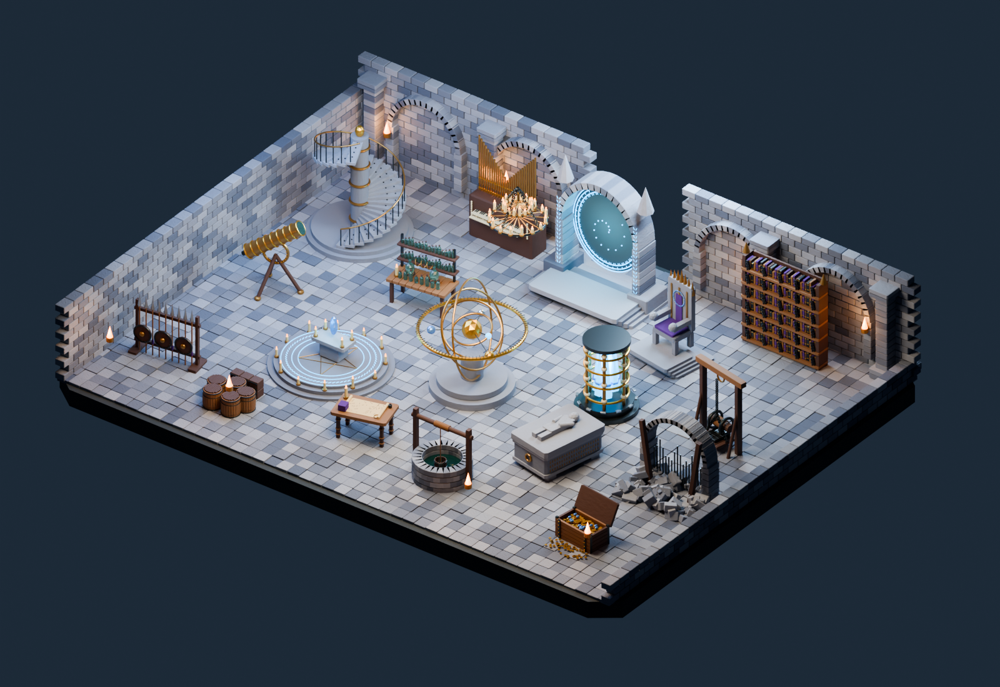

# Faster scene creation with compact recipes

The new workflow turns a short JSON description into editable Blender assemblies, applies revisions by assembly ID, and offers a fast Eevee preview before Cycles refinement. It retains the existing Metal GPU, GPU denoising, persistent-data and batched-operation settings.



The scene contains twenty distinct assembly types, 6,869 mesh objects, 260,854 polygon faces, 91 shared mesh datablocks and sixteen lights. It combines existing procedural construction functions with three new instruments: an orrery, a crystal reactor and a telescope. It is a newly generated scene using reusable building functions, not twenty copied observatories or twenty newly invented asset categories.

## Measured revision performance

Ten warm revisions per path were measured across two independently launched persistent Blender processes. Each process applied five revisions. A revision moves or rotates nine assemblies and changes lighting and a material color. Every image was freshly rendered. All paths preserve the same geometry, material colors and lighting edits.

| Path | Quality | Apply through saved PNG | vs opt1 | vs optNEW |
| --- | --- | ---: | ---: | ---: |
| opt1 | Cycles 64, 1600 × 1100 | 7.202 s | 1.00× | 0.29× |
| optNEW | Cycles 8, 1600 × 1100 | 2.075 s | 3.47× | 1.00× |
| Recipe with Cycles | Cycles 8, 1600 × 1100 | 1.892 s | 3.81× | 1.10× |
| Recipe with Eevee | Eevee 16, 1600 × 1100 | 1.471 s | 4.89× | 1.41× |
| Recipe fast preview | Eevee 4, 800 × 550 | 0.608 s | 11.84× | 3.41× |

These are medians for applying an already written revision, rendering and saving its PNG. They exclude agent authoring, process startup, first render, geometry comparison and saving the `.blend`. Initial renders are recorded separately in the [raw results](../benchmarks/scene-recipes.json). The measured machine was an M2 Max with a 30-core GPU and Blender 5.2.0 LTS. Jobs ran sequentially in seeded shuffled order. OS/driver caches, thermal conditions and unrelated system activity were not controlled.

The fast preview is visibly smaller and grainier, and Eevee lighting differs from Cycles. It is useful for placement and composition. The Cycles recipe path's approximately 10% observed advantage over optNEW is small relative to the variation in these runs. This experiment does not demonstrate a massive equivalent-quality Cycles speedup.

The two representations use the same geometry. The per-part baseline applies a transform to each affected mesh/light, while the recipe path changes assembly roots. Identity parents in the baseline preserve full affine transforms, including nonuniform scale, without altering the geometry. Initial geometry fingerprints match before and after baseline conversion. Final transform differences across lanes are below 0.000001 in matrix components; object IDs, types, face/vertex counts, material colors and light energies match. Three Cycles-8 image comparisons yielded 58.4–70.3 dB PSNR, so results are visually close but not pixel-identical. The raw [image checks](../benchmarks/scene-recipe-images.json) retain the error measurements.

## Recipe authoring observation

After implementing the reusable compiler and factories, an agent wrote the 2,511-byte celestial archive recipe. From a checkpoint immediately before that writing to the first saved scene data and Cycles preview took 76.64 seconds. Visual inspection completed at 113.18 seconds, without a geometry correction to that preview. The builder itself took 0.437 seconds. That first render took 17.785 seconds, illustrating why first-use cost must not be hidden behind warm timings.

The library, three new generators, implementation debugging, benchmarking, viewer development and packaging occurred outside that authoring interval. The first saved scene was written as a Blender library; the delivered example was subsequently packaged as a normal file opening on the correct scene. The prior dungeon's 567-second preparation measurement included planning, code writing, tool calls, rendering, review and an arch correction. Those are different tasks and stages, so their ratio is not a controlled prompt-to-done speedup.

This trial supports the usefulness of a compact authoring interface when the library fits the brief. It does not establish the same timing for twenty unfamiliar asset types. [Authoring checkpoint and result](../benchmarks/scene-recipe-authoring.json).

## Use the new path

Read the [recipe guide](../skills/blender-fast/references/scene-recipes.md). The installed skill routes new scene requests to this interface when the generators fit; unfamiliar shapes should get a new focused factory or the existing batched Python workflow.

From the repository root, with your existing Blender executable:

```sh
blender --background --factory-startup --python-exit-code 1 \
  --python skills/blender-fast/scripts/recipe_cli.py -- \
  examples/scene-recipes/celestial-archive.json --output work/archive --profile optNEW
```

Use `--profile interactive` for the smaller fast preview, `--profile eevee` for full-size Eevee, or `--profile opt1` for the 64-sample comparison profile. Select the actual required quality for final delivery. The command saves an editable scene and a timing report. The current Cycles helper targets Metal and explicitly rejects a missing Metal GPU; other hardware needs its own verified device selection.

For revisions in a persistent process, call `scene_recipe.compiler.apply(updated_recipe, owned_scene)`. Unchanged geometry retains its objects and mesh data. Updates validate before mutation and only affect assemblies owned by the recipe scene. Changed type or seed rebuilds an assembly; removed IDs remove the corresponding owned assembly.

## Live image preview

The live viewer accepts camera, lighting and layout changes, renders them in Blender, and pushes completion events to the browser. Pending changes are combined so the newest request runs next. It does not cancel a GPU render already in progress. It uses a three-image scratch buffer and exposes a save action for the editable scene.

The local functional test measured subsequent camera updates at approximately 0.34 seconds from HTTP submission through receipt of PNG bytes. That includes queueing and transport but excludes browser decoding and painting. It is a small camera-update check, not the same workload as the nine-assembly revision benchmark.

For the comparison UI, prepare a data directory containing `recipe.json`, `initial.png`, `reference.png` and `summary.json`. Use the generated recipe, fast preview, 64-sample render and benchmark summary respectively. Then run:

```sh
python3 preview/recipe_server.py --blender blender \
  --scene work/archive/scene.blend --data work/viewer-data \
  --cache work/viewer-cache --port 8772
```

Open the printed loopback URL. The displayed input-to-image duration includes the 80 ms settling interval when used, queueing, rendering, transfer and decoding. The Cycles reference stays at the original view and is labeled accordingly. The live image reflects the controls. The server binds only to loopback and rejects cross-origin mutation requests.

## Reproduce the benchmark

```sh
python3 examples/scene-recipes/run_benchmark.py --blender blender \
  --scene work/archive/scene.blend --output work/recipe-benchmark \
  --edits 5 --repetitions 2
python3 examples/scene-recipes/summarize.py work/recipe-benchmark \
  --output work/recipe-summary.json
```

The summarizer expects this ten-edit configuration and validates representation equivalence before reporting ratios. Timings include no result-image cache. The scene recipe's seed makes geometry generation reproducible. Absolute timing still depends on hardware, system activity and cache state.

The normal Python suite passed 25 checks, and the isolated Blender test verified ownership, identity-preserving transforms, rejection before mutation, material restoration, type replacement, removal and deterministic construction. A compositor-denoising probe did not produce a verified improvement and is not part of this workflow. Octane NRC and remote neural asset generation remain untested external options; they were not installed or included in these results.
